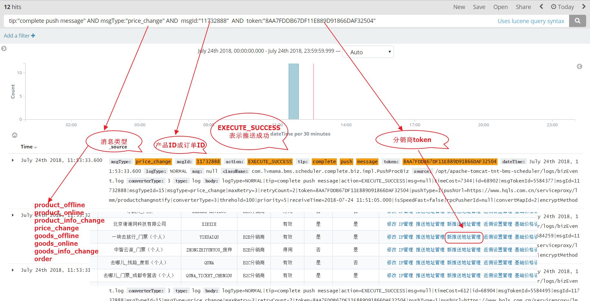
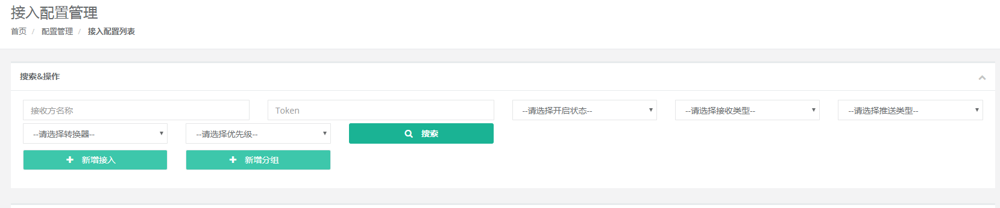
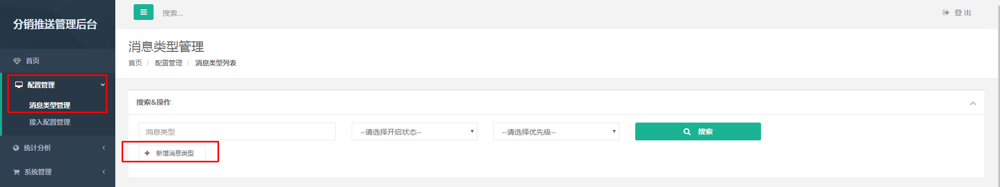
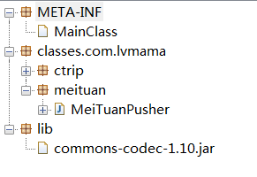
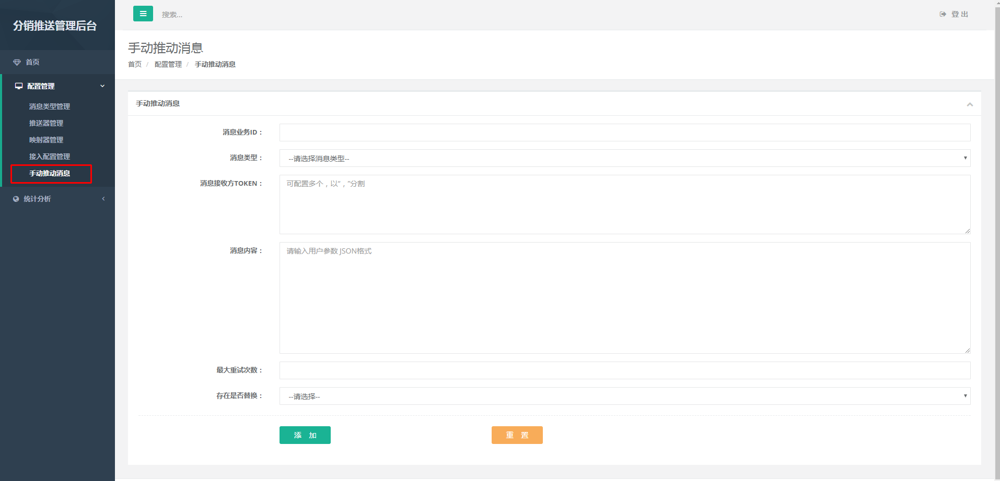

## 基础消息服务

## 使用说明：
### 环境
<i><b>ARK环境</b>  
管理后台：http://10.200.6.188:8080/tnt-bms-admin   
zookeeper地址：10.200.4.74:2181  
集群名称：tnt\_bms\_cluster  
日志系统：[http://10.200.3.97:5601/app/kibana#/discover?_g=()&_a=(columns:!(_source),index:'96:*',interval:auto,query:(match_all:()),sort:!('@timestamp',desc))](http://10.200.3.97:5601/app/kibana#/discover?_g=()&_a=(columns:!(_source),index:'96:*',interval:auto,query:(match_all:()),sort:!('@timestamp',desc)))
<br/><br/><b>仿真环境</b>  
管理后台：http://super.lvmama.com/tnt-bms-admin/  
zookeeper地址：10.200.4.181:2181,192.168.0.208:2181,10.200.4.167:2181  
集群名称：tnt\_bms\_cluster  
日志系统：[http://10.200.6.139:5601/app/kibana#/discover?%5C_g=(refreshInterval:(display:Off,pause:!f,value:0),time:(from:now%2Fd,mode:quick,to:now%2Fd))&%5C_a=(columns:!(%5C_source),filters:!(),index:'lvmama-tnt*',interval:auto,query:(match%5C_all:()),sort:!('@timestamp',desc))&_g=()&_a=(columns:!(_source),index:'lvmama-tnt_message_biz-*',interval:auto,query:(match_all:()),sort:!('@timestamp',desc))](http://10.200.6.139:5601/app/kibana#/discover?%5C_g=(refreshInterval:(display:Off,pause:!f,value:0),time:(from:now%2Fd,mode:quick,to:now%2Fd))&%5C_a=(columns:!(%5C_source),filters:!(),index:'lvmama-tnt*',interval:auto,query:(match%5C_all:()),sort:!('@timestamp',desc))&_g=()&_a=(columns:!(_source),index:'lvmama-tnt_message_biz-*',interval:auto,query:(match_all:()),sort:!('@timestamp',desc)))
<br/><br/><b>生产环境</b>  
管理后台：http://super.lvmama.com/tnt-bms-admin/  
zookeeper地址：192.168.50.213:2181,192.168.50.214:2181,192.168.50.215:2181  
集群名称：tnt\_bms\_cluster  
日志系统：[http://super.lvmama.com/prism-web/es5_kibana/app/kibana](http://super.lvmama.com/prism-web/es5_kibana/app/kibana)
</b></i>
<br/><br/>


### 1. 接入   
通过管理后台或接口添加接收方消息，接入支持分组管理。分组上有的属性，组内成员相应的属性可不填（分组名称必填，成员名称和推送地址必填），取的是分组上的属性，成员属性会覆盖分组属性。
接入接收方和分组为同一个接口，两者用法只是参数上稍有不同，具体看一下说明。
1. 接入接口目前支持`Restful`接口，`URL: (http://ip:port/tnt-bms-admin/config/access/addNews)`，入参出参说明如下表：
    - 入参，目前仅支持json格式
    
            {
                "converterType": 1,
                "name": "resutfulAccessName",
                "priority": 4,
                "pushType": 1,
                "pushUrl": "http://localhost:8082/bms-admin-web/news/access/addNews",
                "receiveType": 2,
                "threshold": 3,
                "mode":"",
                "groupToken":"",
                "convertMap":""
            }
    
    字段说明：
        <table>
            <thead>
                <tr>
                    <th>字段</th>
                    <th>类型</th>
                    <th>成员是否必填</th>
                    <th>分组是否必填</th>
                    <th>说明</th>
                </tr>
            </thead>
            <tbody>
                <tr>
                    <td>name</td>
                    <td>String</td>
                    <td>是</td>
                    <td>是</td>
                    <td>接收方名称</td>
                </tr>
                <tr>
                    <td>receiveType</td>
                    <td>Integer</td>
                    <td>是</td>
                    <td>否</td>
                    <td>接收类型，1：推送，2：拉取</td>
                </tr>
                <tr>
                    <td>pushType</td>
                    <td>Integer</td>
                    <td>是</td>
                    <td>否</td>
                    <td>推送类型，1：HTTP，2：TCP，3：RPC</td>
                </tr>
                <tr>
                    <td>pushUrl</td>
                    <td>String</td>
                    <td>是</td>
                    <td>否</td>
                    <td>推送接口地址</td>
                </tr>
                <tr>
                    <td>opened</td>
                    <td>Integer</td>
                    <td>否</td>
                    <td>否</td>
                    <td>开关，1：开启（默认），0：关闭</td>
                </tr>
                <tr>
                    <td>converterType</td>
                    <td>Integer</td>
                    <td>是</td>
                    <td>否</td>
                    <td>转换器，1：json，2：xml，3：form</td>
                </tr>
                <tr>
                    <td>priority</td>
                    <td>Integer</td>
                    <td>否</td>
                    <td>否</td>
                    <td>推送优先级，1-10个优先级，默认为5</td>
                </tr>
                <tr>
                    <td>threshold</td>
                    <td>Integer</td>
                    <td>是</td>
                    <td>否</td>
                    <td>拉取频率或发送频率限制，接入时评估推送URL能承受的压力</td>
                </tr>
                <tr>
                    <td>groupToken</td>
                    <td>String</td>
                    <td>否</td>
                    <td>否</td>
                    <td>成员需要加入分组，必须填写分组的token，不需要加入分组则不必填写，须和下面的接口模式一致</td>
                </tr>
                 <tr>
                    <td>mode</td>
                    <td>String</td>
                    <td>是</td>
                    <td>是</td>
                    <td>group：新建分组；access：新建接收方</td>
                </tr>
                <tr>
                    <td>convertMap</td>
                    <td>String</td>
                    <td>是</td>
                    <td>是</td>
                    <td>推送给分销商时组装数据的格式</td>
                </tr>
            </tbody>
        <table>
    - 出参，支持json格式
    
            {
                "success": true,
                "resCode": "10000",
                "resMsg": "接入成功",
                "result": "3729fc72-317b-42e9-a138-201b8b0563d9"
            }
            
    字段说明：
        <table>
            <thead>
                <tr>
                    <th>字段</th>
                    <th>说明</th>
                </tr>
            </thead>
            <tbody>
                <tr>
                    <td>success</td>
                    <td>是否成功，true ：成功，false：失败</td>
                </tr>
                <tr>
                    <td>resCode</td>
                    <td>返回码</td>
                </tr>
                <tr>
                    <td>resMsg</td>
                    <td>返回说明，如失败原因等</td>
                </tr>
                <tr>
                    <td>result</td>
                    <td>接入成功会生成一个token，保存好token，后期发送时使用</td>
                </tr>
            </tbody>
        <table>

>其他CURD API
- 修改：http://ip:port/tnt-bms-admin/config/access/editNews（参数和接入一样，带上需要修改的字段和ID）
- 查询：http://ip:port/tnt-bms-admin/config/access/find/{accessID}
        <br/>http://ip:port/tnt-bms-admin/config/access/find/token/{token}
- 删除：http://ip:port/tnt-bms-admin/config/access/delete/{accessID}
        <br/>http://ip:port/tnt-bms-admin/config/access/delete/{token}

-----

##### 2. 管理后台接入界面(URL:http://ip:port/tnt-bms-admin/config/access/list)


### 2. 消息类型配置(URL:http://ip:port/tnt-bms-admin/config/type/list)


### 3. 映射器配置
消息提交的Object对象经转换器(json/xml/form)+映射器处理，格式化为接收方要求的数据格式，映射器通过xml配置，示例如下：
````
映射器新版本
示例1
Xml请求映射
<?xml version="1.0" encoding="utf-8" ?>
<request>
    <header> 
    </header>
    <body>
        <changeType><script>payload.changeType</script></changeType>
        <foreach collection="payload.products"> //foreach迭代生成内容
            <product>
                <productId>
                    <script isEncrypt="false">
                        #item.productId+#encryptKey+payload.header.signed+','+payload.body.order.orderId+','+payload.body.order.policies[0].name+concat(payload.body.order.policies, item, item.name, ',')
                    </script>
                </productId> //script执行脚本
                <goodsId><script>#item.goodsId</script></goodsId>
            </product>
        </foreach>
    </body>
</request>
	
请求源数据(Message.payload)
{"changeType":"product","products":[{"productId":"productId0","goodsId":"goodsId0"},{"productId":"productId1","goodsId":"goodsId1"},{"productId":"productId2","goodsId":"goodsId2"}]}

响应映射：
<response type="xml" path="response.@status" value="200"/>
//response用于请求结果解析，type默认值为status，path用于指定响应结果中的节点路径，当path节点值与value相等表示请求成功
//status： Http响应状态标识请求是否成功，value默认值为2XX，支持java正则表达式
//xml：响应内容为Xml格式，路径为path的节点值与value相等表示请求成功
//json：响应内容为Json格式，路径为path的节点值与value相等表示请求成功
	
示例2(Json)
{

    "product": {
            "changeType" : "<script>payload.changeType</script>",
            "list" : [
                <foreach collection="payload.products" separator=",">
                    {
                        "productId": "<script>#item.productId</script>",
                        "goodsId": "<script>#item.goodsId</script>"
                    }
                </foreach>
            ]
        }
}
源数据(Message.payload)
{"changeType":"product","products":[{"productId":"productId0","goodsId":"goodsId0"},{"productId":"productId1","goodsId":"goodsId1"},{"productId":"productId2","goodsId":"goodsId2"}]}

	
示例3(Form)		
product=
<?xml version="1.0" encoding="utf-8" ?>
<request>
    <header> 
    </header>
    <body>
        <changeType><script>payload.changeType</script></changeType>
        <foreach collection="payload">
            <product>
                <productId><script>#item.productId</script></productId>
                <goodsId><script>#item.goodsId</script></goodsId>
            </product>
        </foreach>
    </body>
</request>	
源数据(Message.payload)
[{"productId":2987715,"changeIds":4167035,"goodsId":4167035},{"productId":29877151,"changeIds":41670351,"goodsId":41670351}]

	
映射器老版本
请求映射：
<mapping>		
    <type name="request"> //type支持对象嵌套
    <bind name="request"/> //指定类型绑定名称
        <prop name="header" type="header" isMulti="false">
            <bind name="header" />
        </prop>
        <prop name="body" type="body" isMulti="false">
            <bind name="body" />
        </prop>        
    </type>
    <type name="header">
        <prop name="signed" >  //指定对象属性的绑定信息
            <bind name="signed" isAttr="false"/> //isAttr设置是否为节点属性(针对xml输出格式)
            //script用于执行脚本，isEncrypt属性标识是否加密脚本执行结果，通过#encryptKey引用管理后台配置的秘钥，通过payload.XXX.XXX引用构建Message时传入的payload数据
            //连接集合元素，concat(collection集合对象, item集合项, item.XXX集合项属性值, '连接符')
            <script isEncrypt="true"> 
                #encryptKey+payload.header.signed+','+payload.body.order.orderId+','+payload.body.order.policies[0]+concat(payload.body.order.policies, item, item.name, ',')
            </encrypt>		
        </prop>
    </type>    
    <type name="body">
        <prop name="order" type="order" isMulti="false">
            <bind name="order" />
        </prop> 
    </type>    
    <type name="order">
        <prop name="orderId" >
            <bind name="orderId" isAttr="false"/>
        </prop>
        <prop name="status" >
            <bind name="status" isAttr="false"/>
        </prop>
        <prop name="paymentStatus" >
            <bind name="paymentStatus" isAttr="false"/>
        </prop>
        <prop name="policies" type="policy" isMulti="true"> //对象嵌套，isMulti指定是否为数组，wrapName为包装元素名称
            <bind name="policy" wrapName="policies"/>
        </prop>
    </type>    
    <type name="policy">
        <prop name="name" >
            <bind name="name" isAttr="false"/>
        </prop>
        <prop name="credentials">
            <bind name="credentials" isAttr="false"/>
        </prop>
        <prop name="policyStatus">
            <bind name="policyStatus" isAttr="false"/>
        </prop>
        <prop name="policyNumber">
            <bind name="policyNumber" isAttr="false"/>
        </prop>
        <prop name="remarks">
            <bind name="remarks" isAttr="false"/>
        </prop>
    </type>
</mapping>
````

### 4. 消息推送器配置
1)添加依赖
```
添加maven依赖
 <dependency>
    <artifactId>tnt-bms-extend</artifactId>
    <groupId>com.lvmama</groupId>
    <version>1.0-SNAPSHOT</version>
</dependency>
```
2)实现RpcPusher接口或继承AbstractRpcPusher
```
//实现RpcPusher接口方式
import com.lvmama.bms.extend.rpc.Message;
import com.lvmama.bms.extend.rpc.Result;
import com.lvmama.bms.extend.rpc.RpcPusher;
public class CtripMsgPusher implements RpcPusher {

    @Override
    public Result push(Message message) {
        System.out.println(CtripConstant.class);
        return Result.SUCCESS;
    }
}

//继承AbstractRpcPusher方式
import com.lvmama.bms.extend.rpc.AbstractRpcPusher;
import com.lvmama.bms.extend.rpc.Message;
import com.lvmama.bms.extend.rpc.Result;
public class MeiTuanPusher extends AbstractRpcPusher {
    
    @Override
    public Result push(Message message) {
        try {
            //实现AbstractRpcPusher类会自动注入在管理后台配置的转换器
            String format = converter.formatMessage(message.getMsgContent());
            System.out.println(format);
            return Result.SUCCESS;
        } catch (Exception e) {
            e.printStackTrace();
            return Result.FAILED;
        }
    }
}
```
3)在MEAT-INF/MainClass文件中指定实现类的全路径，在classes下存放实现类，在lib目录下存放私有jar包，打成jar包，上传到管理后台  


### 5. 手动推送消息


### 6. 消息发送   
```
添加maven依赖
 <dependency>
    <artifactId>tnt-bms-client</artifactId>
    <groupId>com.lvmama</groupId>
    <version>1.2-SNAPSHOT</version>
</dependency>
```
```
//线程安全，建议单例模式使用
MessageClient messageClient = new MessageClient(); 
或 
MessageClient messageClient = new RetryMessageClient(); //支持失败重试

//集群名称
messageClient.setClusterName("tnt_bms_cluster");
//设置zookeeper注册地址
messageClient.setRegistryAddress("zookeeper://10.200.4.74:2181");
//启动消息客户端
messageClient.start();
Message message = new Message();
//消息业务Id
message.setMsgId("10110");
//消息类型，管理后台配置
message.setMsgType("PRICE_CHANGE");
//消息接收方，接入返回的token
message.setTokens(new String[]{"3E7656A2D07C45F4BAEDD2FB3AE16C1C", "25459B447AE644AA92FE3E2D45207E19", "A42B86551F554173854C047116B0DD97"});
//消息内容，Object类型
message.setPayload(new Object());
//是否替换msgId+msgType相同的消息，当关闭此选项时，允许存在多条msgId+msgType相同的消息
message.setReplaceOnExist(true);
//发送失败重试次数
message.setMaxRetry(0);
Response response = messageClient.sendMessage(message);
```
